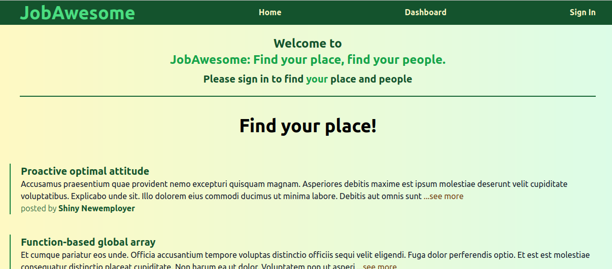
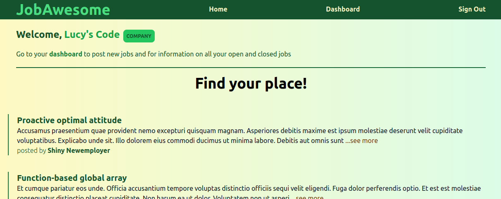
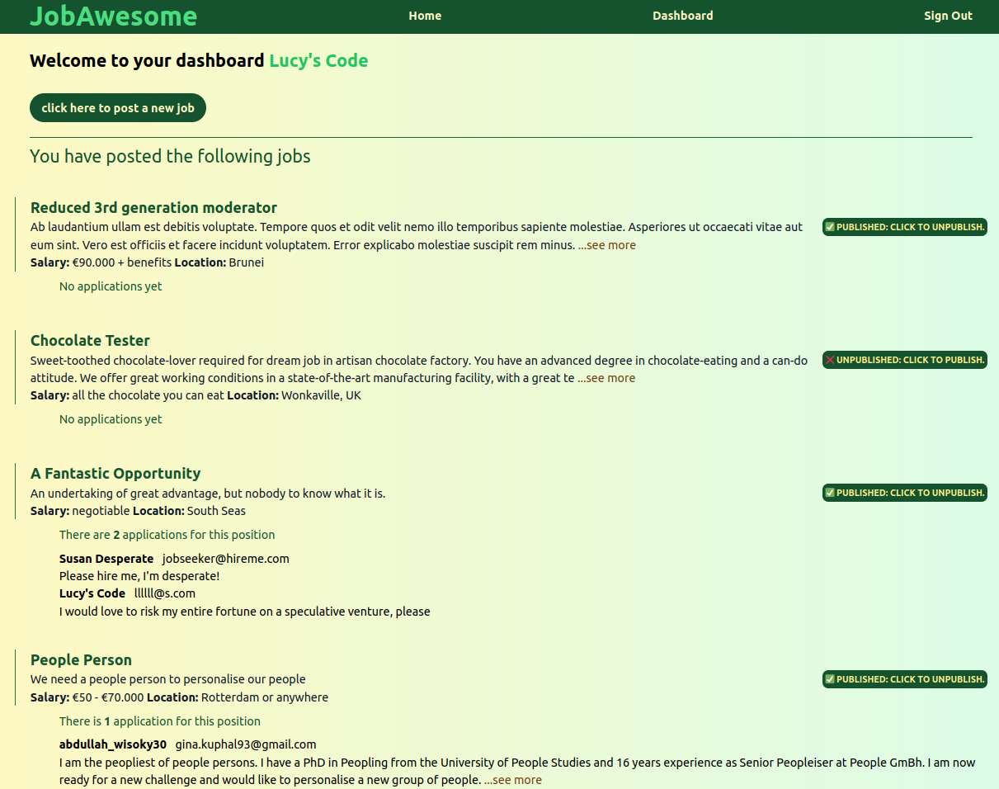

## JobAwesome Job Board
From a [tutorial](https://github.com/flaviocopes/bootcamp-2022-week-10-job-board) by [Flavio Copes](https://github.com/flaviocopes)

### Personal additions
- navigation bar
- conditional rendering of sign in / sign out button
- Welcome message and reduced functionality for non-signed in users
- displays first 250 characters of job postings and application letters, with ...see more function
- displays location and salary information where given
- "apply now" button not rendered for company users, and and "posted by" information not rendered on company's own dashboard
- conditional display of plural when there is more than one application
- allows company to email applicants direct

### Deployed on Vercel
[JobAwesome](https://job-board-red.vercel.app/)

### App images

